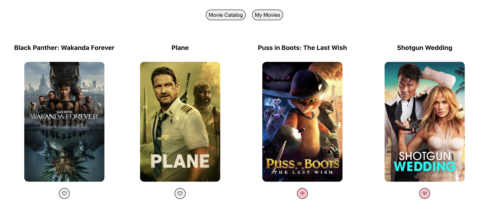

# Full-stack app review

In this repository, you will build a full stack movie catalog app using React, Node/Express, and MySQL.

## Getting ready for the MVP!

## Objectives

- Think of the steps to follow before you start coding and write them down
- Write code from scratch for the first time, YAY! Google everything you need and look at previous code
- Check if the code is doing what you expected (console.log, check React Dev Tools, use Postman)
- Debug and repeat!

## Setup

### Get your API key

We'll be using [The Movie Database API](https://www.themoviedb.org/) for this project. You can sign
up [here](https://www.themoviedb.org/signup) and follow the
instructions [here](https://developers.themoviedb.org/3/getting-started/introduction) to get your own API key (v3 auth).
Copy your API key and add it to the `.env.example` file in the client folder, and rename it to `.env`.

### Dependencies

- Run `npm install` in the project folder to install dependencies related to Express (the server)
- `cd client` and run `npm install` to install dependencies related to React (the client)

### Run Your Development Servers

- Run `npm start` in the project directory to start the Express server on port 5000 (you may need to change this if your OS has something running there already)
- `cd client` and run `npm start` to start the client server in development mode with hot reloading in port 3000
- Client is configured so that all API calls will be proxied to port 5000 for a smoother development experience, yay!
- You can test your client app in `http://localhost:3000`
- You can test your API in `http://localhost:5000/` (it should respond with `{ title: 'Express' }`)

## Basic Requirements

#### Part I: Movie catalog

- Take your time to think of the steps to build a movie catalog considering:
    - Movie title and poster should be displayed for each movie
    - The user should be able to see other movie options by clicking a 'Other movies' button. **Hint:** you will need to
      use
      the `page` in your query params, and take a look at
      the [React docs](https://beta.reactjs.org/reference/react/useEffect#useeffect) to understand useEffect
      dependencies.

- You can get the movies information from TMDB:
    - Check their API docs to access movies data [here](https://developers.themoviedb.org/3/discover/movie-discover)
    - You can also access the poster images as
      described [here](https://developers.themoviedb.org/3/getting-started/images)

- **Bonus:** Instead of the 'Other movies' button, add two buttons: one to go to the previous page, and the other one to
  the next page!

#### Part II: Save movies feature

- Take your time to think of the steps to build this feature considering:
    - Each movie should have a button to save movies. You can
      check [React Icons](https://react-icons.github.io/react-icons/), install it and use it to add a heart to the
      button.
    - A movie should be saved to a database when the user clicks on the heart button. **Hint**: edit `database.js` to
      define your movies table, next create it running `npm run migrate`, don't forget to create your DB in
      MySQL
      first, and add the relevant information in a `.env` file
    - Once a movie is saved, it should not be possible to save it again
    - Saved movies should be displayed in another view
    - A user should be able to switch between the 'Movie Catalog' and 'My Movies' view
- **Bonus:** In the movie catalog view, change the looks of the heart button of saved movies to show that the movie has
  been saved. Additionally, you can add the functionality to remove a movie when clicking on that button!

_This is a student project that was created at [CodeOp](http://CodeOp.tech), a full stack development bootcamp in
Barcelona._

